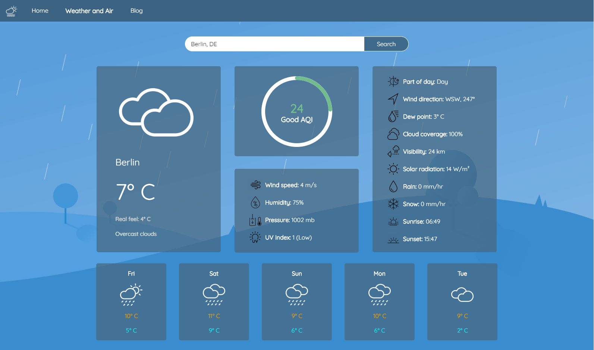

# Weather-Air-check

## About 

A responsive, single-page, React.js web application that provides info about the weather forecast and air quality using API service. It provides data for current weather conditions, forecast for the following 5 days and air quality index. Air quality is presented through an animated circle, followed with the proper description and providing data for the main AQI (Air Quality Index).

Weather data provides:
- Current conditions: weather icon [custom component], temperature, real feel temperature, weather description, wind speed, humidity, pressure, uv index, part of day, wind direction, dew point, cloud coverage, visibility, solar radiation, rain and snow info, sunrise and sunset time.
- Forecast [5 days]: day name, weather icon, min & max temperature. 

AQI scale is ranged according to USA criteria:
- 0 - 50 (Good AQI)
- 51 - 100 (Moderate AQI)
- 100+ (Poor AQI)

## Routes

- Home page in progress...

- Weather and Air 

- Blog page in progress...

## Deployment
In progress...

## Technologies & Tools

- React.js
- CSS3
- React Bootstrap 4
- Ajax
- Visual Studio Code

## Includes

- API
- Routing
- React Hooks
- Axios
- React Moment
- Progress bar
- Forms 

## Purpose

Individual student project for the Seavus Code Academy

## Author

Riste Spasov