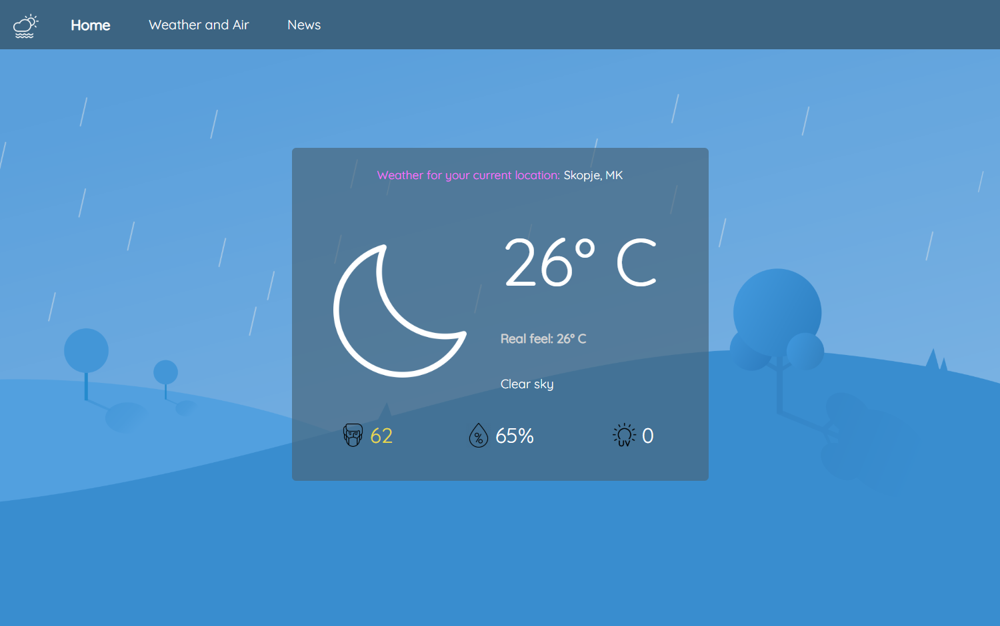
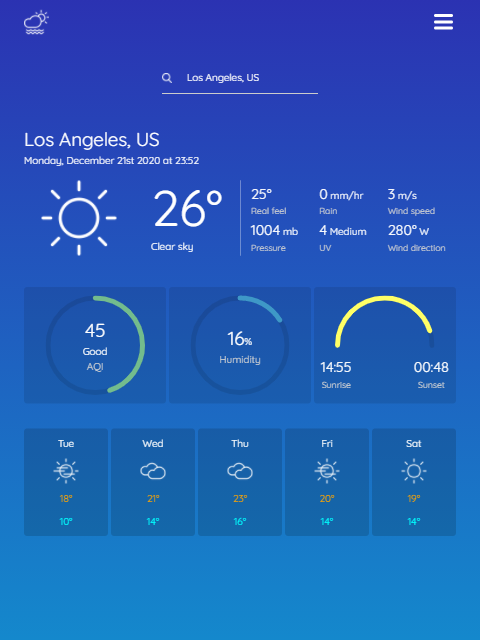
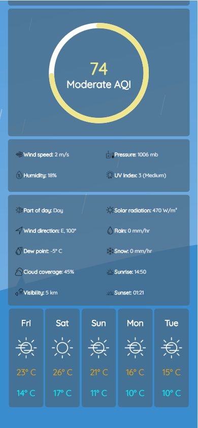

# Weathery

## About 

Weathery provides data for current weather conditions, forecast and air quality index. Contains an auto location finder and allows a custom search.

## Routes

- Home page

- Weather and Air

 

- News page in progress...

## Deployment
Netlify: https://weathery-19project.netlify.app/

## Technologies & Tools

- React.js
- CSS3
- Visual Studio Code

## Includes

- API
- Routing
- React Hooks
- Axios
- React Moment
- CountUp
- Progress Bar
